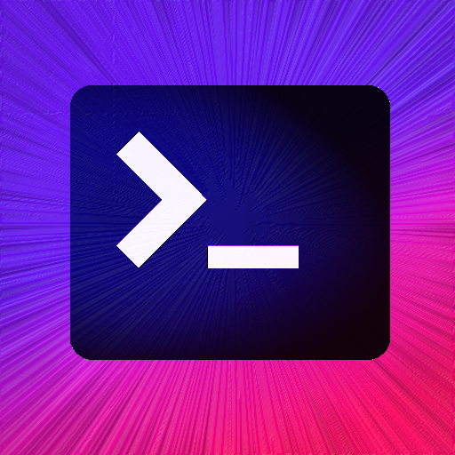

# manyTerm
## Tmux for the rest of us

## This Working POC showcase

## Idea

Bring conviniance of workflow known from tools like tmux to desktop gui.
Terminal is main utility, but additional components are planned for complete workflow: 

* Local and remote file manager. 
  By default each terminal will have one instance behind it with current location in sync between them.

* Monacco based text editor with linter and source code format tools.
  Will be capable of editing files directly from terminal and file manager.

Main goal is to keep things as simple, performant and lightweight as possible by passing on all possible dependencies.

* No webpack

* No React / Vue / Angular 

* Alpinejs for reactive features - https://github.com/alpinejs/alpine
 

## Libs used in POC
Tabs and panes with Golden Layout library - http://golden-layout.com/

Terminal with outstanding xterm.js project - https://xtermjs.org/

Electron - we all know this one I guess - https://electronjs.org/

## Other tools

You can currently try this workflow approach with

* Extraterm - https://extraterm.org/  

* Sublime Text 3 with Terminus package - https://packagecontrol.io/packages/Terminus 

* Theia for Electron - https://github.com/theia-ide/theia-apps 
  (Early stage - app needs some extra work to make it usable)

